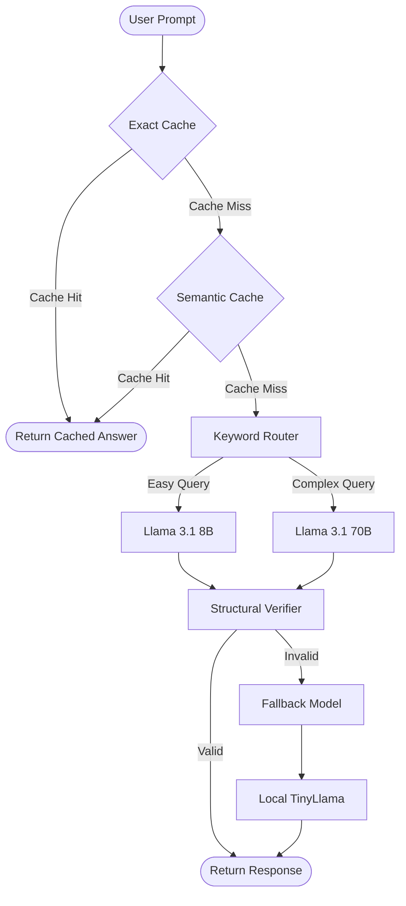
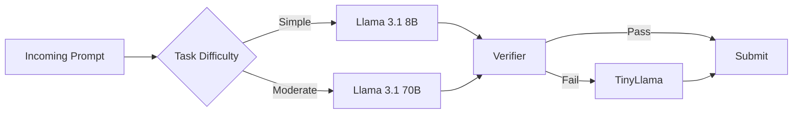
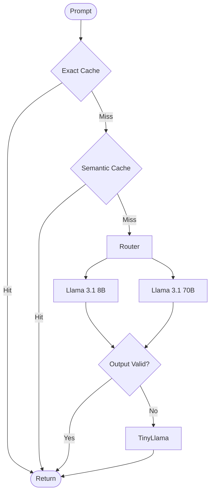
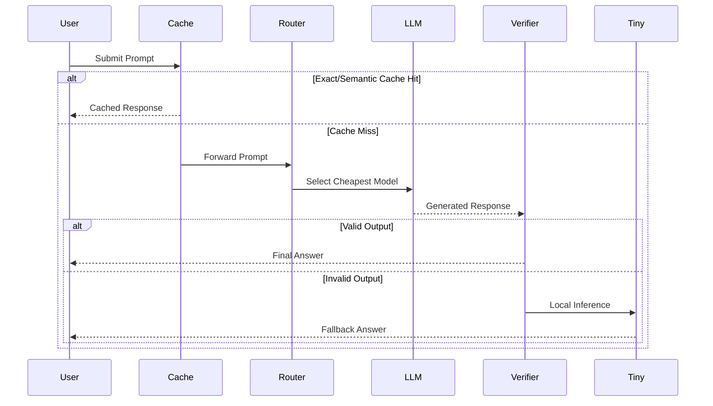
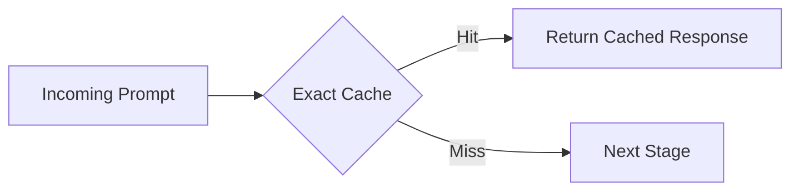
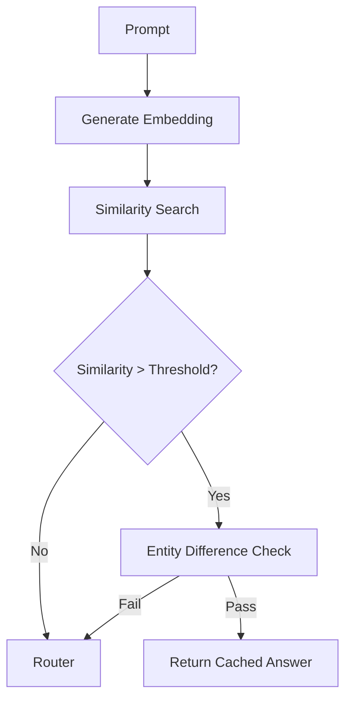
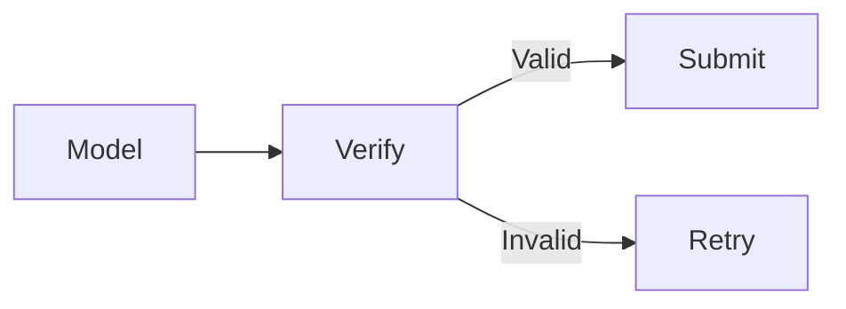
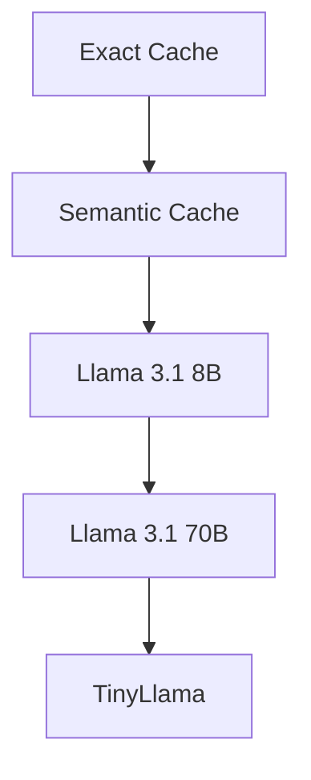
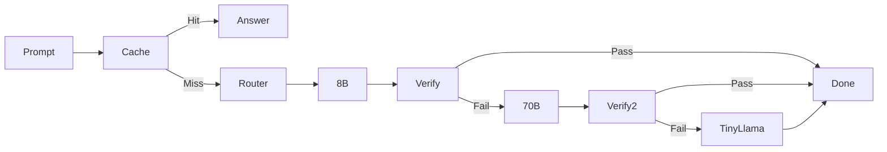

# 🚀 AMD Hackathon Act II — Track 1
## Hybrid Token-Efficient Routing Agent

<div align="center">

[](https://www.python.org/)
[](https://fireworks.ai/)
[](https://www.docker.com/)
[](https://lablab.ai/)
[](#)
[](LICENSE)

### 🏆 Cost-Aware Multi-Model Routing Agent

**Building an AI agent that solves tasks with the _fewest possible tokens_ while maintaining high accuracy through intelligent routing, caching, verification, and fallback mechanisms.**

*Designed for the AMD Hackathon Act II — Track 1: Hybrid Token-Efficient Routing Agent.*

</div>

---

# 📖 Table of Contents

- [🎯 Problem Statement](#-problem-statement)
- [💡 Solution Overview](#-solution-overview)
- [✨ Key Features](#-key-features)
- [🏗️ System Architecture](#️-system-architecture)
- [⚙️ Pipeline Breakdown](#️-pipeline-breakdown)
- [🧠 Routing Strategy](#-routing-strategy)
- [🛠️ Tech Stack](#️-tech-stack)
- [📂 Project Structure](#-project-structure)
- [🚀 Getting Started](#-getting-started)
- [🔑 Environment Variables](#-environment-variables)
- [📊 Benchmark Results](#-benchmark-results)
- [🔬 Design Decisions](#-design-decisions)
- [🔮 Future Improvements](#-future-improvements)
- [🙏 Acknowledgements](#-acknowledgements)
- [📄 License](#-license)

---

# 🎯 Problem Statement

The AMD Hackathon Track 1 presents a deceptively simple objective:

> **Solve every task while consuming the fewest possible inference tokens.**

Unlike traditional LLM applications where maximizing model capability is the primary goal, this competition rewards **token efficiency** while maintaining **high accuracy**.

The challenge quickly becomes an optimization problem:

- Large models provide better reasoning but consume significantly more tokens.
- Small models are inexpensive but occasionally fail on difficult prompts.
- Blindly choosing one model for every request either wastes tokens or sacrifices accuracy.

Our objective was therefore **not to build the smartest model**, but to build the **smartest routing system**.

---

# ⚡ The Core Idea

Instead of asking:

> **"Which model is the best?"**

we ask:

> **"What is the cheapest model capable of answering this specific prompt correctly?"**

This shift in perspective led to a hierarchical routing architecture that aggressively minimizes token consumption while preserving reliability.

---

# ❌ Traditional Approaches

| Strategy | Accuracy | Token Cost | Drawback |
|-----------|----------|------------|----------|
| Always use 405B | ⭐⭐⭐⭐⭐ | 💸💸💸💸💸 | Extremely expensive |
| Always use 70B | ⭐⭐⭐⭐☆ | 💸💸💸 | Still costly |
| Always use 8B | ⭐⭐☆☆☆ | 💸 | Accuracy suffers |
| Random routing | ⭐⭐⭐☆☆ | ❓ | Unpredictable |
| **Our Hybrid Router** | ⭐⭐⭐⭐⭐ | 💸 | Cost-aware and adaptive |

---

# 💡 Solution Overview

Our system is built around one simple philosophy:

> **Never spend tokens unless absolutely necessary.**

Every incoming prompt passes through a series of progressively more expensive stages.

Whenever possible, the request is answered **without contacting any external language model**.

Only when cheaper methods fail do we escalate to increasingly capable models.

This architecture dramatically reduces average token usage while maintaining competitive accuracy.

---

# ✨ Key Features

- 🚀 Exact-match response cache (0 tokens)
- 🧠 Semantic cache using sentence embeddings
- 🎯 Intelligent keyword-based model routing
- 💰 Cost-aware multi-model inference
- 🛡️ Structural output verification
- 🔁 Automatic fallback mechanism
- 🖥️ Offline TinyLlama emergency inference
- 📉 Aggressive output token capping
- 🐳 Fully Dockerized deployment
- ⚡ Fast inference with minimal latency

---

# 🏆 Optimization Philosophy

Our routing strategy follows four guiding principles:

1. **Cache before Compute**  
   Reuse previous knowledge whenever possible.

2. **Cheap before Smart**  
   Always attempt the least expensive capable model first.

3. **Verify before Accept**  
   Every generated response is validated before submission.

4. **Escalate only when Necessary**  
   Larger models are used only if cheaper approaches fail.

These principles allow the system to achieve an excellent balance between **cost**, **speed**, and **accuracy**, making it particularly effective in token-constrained evaluation environments.

---

# 🏗️ System Architecture

Our agent follows a **hierarchical cost-aware routing architecture**. Every prompt traverses a sequence of increasingly expensive stages. Most requests are answered long before reaching the larger language models, dramatically reducing average token consumption.

The guiding philosophy is simple:

> **Spend zero tokens whenever possible. Spend the minimum required otherwise.**

---

## 🔄 End-to-End Inference Pipeline



---

# 🧠 Routing Strategy

Rather than selecting one model for every prompt, our system dynamically decides **which model is sufficiently capable** for the incoming task.

This significantly reduces unnecessary inference cost.



---

# ⚙️ Pipeline Breakdown

Our inference pipeline consists of **six progressively more expensive stages**.

| Stage | Component | Token Cost | Purpose |
|--------|-----------|------------|----------|
| 1 | Exact Cache | 🟢 0 | Return previously solved prompts instantly |
| 2 | Semantic Cache | 🟢 0 | Detect paraphrased prompts using embeddings |
| 3 | Keyword Router | 🟢 0 | Decide the cheapest capable model |
| 4 | LLM Generation | 🟡 Low | Generate a concise answer |
| 5 | Structural Verifier | 🟢 0 | Reject malformed or low-quality outputs |
| 6 | Local Fallback | 🟢 0 | Guarantee a response if APIs fail |

---

# 🧩 Complete Decision Flow



---

# 🔁 Request Lifecycle

The following sequence diagram illustrates the interaction between every major component during inference.



---

# 🎯 Why This Architecture Works

Instead of optimizing only for **accuracy**, our system jointly optimizes three objectives:

- 💰 **Minimal token consumption**
- ⚡ **Low latency**
- 🎯 **High task accuracy**

Every stage exists to eliminate unnecessary LLM calls while preserving answer quality.

This layered approach enables the agent to achieve a substantially lower average token budget than a naive single-model solution, making it particularly effective for token-constrained evaluations like the AMD Hackathon.

---

# ⚙️ Pipeline Breakdown

This section dives deeper into each stage of the routing pipeline and explains **why each component exists**. The goal is simple:

> **Minimize token usage without sacrificing correctness.**

Every request travels through progressively more expensive stages, stopping as soon as a reliable answer is found.

---

# 🗄️ Stage 1 — Exact Match Cache (0 Tokens)

The fastest and cheapest response is one that has already been computed.

Incoming prompts are first compared against an exact-match cache containing previously solved benchmark questions.

If an identical prompt exists, the cached response is returned immediately.

### Benefits

- ⚡ Instant response
- 💰 Zero API calls
- 🪙 Zero token consumption
- 🎯 Perfect accuracy for repeated prompts



---

# 🧠 Stage 2 — Semantic Cache (0 Tokens)

Not every repeated question is worded identically.

To capture paraphrased prompts, we compute sentence embeddings using **all-MiniLM-L6-v2** and compare them against cached embeddings.

Examples:

- "2 + 2"
- "What is two plus two?"
- "Calculate 2 plus 2"

Although textually different, these prompts represent the same semantic intent.

### Additional Safety

To avoid false matches, an **entity-difference check** verifies that important values (numbers, names, dates, identifiers) have not changed before returning a cached answer.



---

# 🎯 Stage 3 — Keyword Router

Only after both cache layers fail do we consider invoking an LLM.

Instead of using another model to classify prompts, we employ a lightweight rule-based keyword router.

This introduces **zero additional inference cost**.

Typical routing logic:

| Query Type | Target Model |
|------------|--------------|
| Arithmetic | 8B |
| Simple reasoning | 8B |
| Factual lookup | 8B |
| Programming | 70B |
| Algorithms | 70B |
| Long explanations | 70B |

Because routing is deterministic, the overhead is effectively negligible.

---

# 🤖 Stage 4 — Cost-Aware Generation

The selected model generates the answer under aggressive token constraints.

Rather than allowing unrestricted outputs, we intentionally cap the maximum generation length.

| Model | Max Output Tokens |
|--------|-------------------|
| Llama 3.1 8B | 15 |
| Llama 3.1 70B | 40 |

Most benchmark questions require only a short answer.

Examples:

```
Paris
```

```
42
```

```
Binary Search
```

Producing concise responses dramatically reduces total token usage without affecting correctness.

---

# 🛡️ Stage 5 — Structural Verification

Generating an answer does not necessarily mean it is acceptable.

A lightweight verifier examines every response before submission.

The verifier rejects outputs that exhibit common failure patterns, including:

- Empty responses
- Model refusals
- Placeholder text
- Hallucinated system messages
- Malformed formatting

Examples of rejected outputs:

```text
I'm sorry, but I can't help with that.
```

```text
As an AI language model...
```

```text
No response generated.
```

Only structurally valid responses are accepted.



---

# 🆘 Stage 6 — Local TinyLlama Fallback

In rare situations where remote inference fails or produces unusable output, the request is redirected to a local TinyLlama model.

Although smaller than the primary models, TinyLlama provides an important safety net.

Advantages:

- No external API dependency
- Zero Fireworks tokens
- Offline execution
- Graceful degradation

This guarantees that the agent always attempts to produce a meaningful answer instead of failing outright.

---

# 📉 Token Optimization Techniques

Several independent optimizations work together to minimize overall token consumption.

| Optimization | Benefit |
|--------------|----------|
| Exact Cache | Eliminates repeated inference |
| Semantic Cache | Handles paraphrased prompts |
| Rule-Based Router | Zero-cost model selection |
| Output Token Caps | Shorter generations |
| Structural Verification | Prevents wasted retries |
| TinyLlama Fallback | Avoids expensive recovery calls |

No single optimization is responsible for the savings; rather, the cumulative effect of each stage produces substantial reductions in average token usage.

---

# 📊 Cost Hierarchy



Moving downward increases computational cost, so the router always attempts to resolve requests at the highest possible (cheapest) stage before escalating.

---

# 🛠️ Tech Stack

The project combines lightweight local components with cloud-hosted LLMs to achieve an optimal balance between **cost**, **speed**, and **accuracy**.

| Category | Technology | Purpose |
|-----------|------------|---------|
| Programming Language | Python 3.10+ | Core implementation |
| LLM Provider | Fireworks AI | Remote inference APIs |
| Large Language Models | Llama 3.1 8B, Llama 3.1 70B | Primary reasoning models |
| Local Model | TinyLlama 1.1B | Offline fallback inference |
| Embeddings | Sentence-Transformers (all-MiniLM-L6-v2) | Semantic caching |
| Containerization | Docker | Portable deployment |
| Environment Management | python-dotenv | API key configuration |
| HTTP Client | Requests / HTTPX | Fireworks API communication |

---

# 📂 Project Structure

```text
amd-hackathon-agent/
│
├── main.py                 # Application entry point
├── router.py               # Model routing logic
├── verifier.py             # Structural output verification
├── cache.py                # Exact & semantic cache
├── embeddings.py           # Sentence embedding utilities
├── fireworks_client.py     # Fireworks API wrapper
├── tinyllama.py            # Local fallback model
├── prompts.py              # Prompt templates
├── utils.py                # Shared helper functions
│
├── tests/
│   ├── test_router.py
│   ├── test_cache.py
│   └── test_verifier.py
│
├── Dockerfile
├── requirements.txt
├── .env.example
└── README.md
```

> **Note:** The exact structure may vary depending on implementation, but the core components remain the same.

---

# 🚀 Getting Started

## Prerequisites

Before running the project, ensure you have the following installed:

- Python **3.10** or newer
- Docker *(optional but recommended)*
- A valid Fireworks AI API key

Verify your Python version:

```bash
python --version
```

---

## 1️⃣ Clone the Repository

```bash
git clone https://github.com/yourusername/amd-hackathon-agent.git

cd amd-hackathon-agent
```

---

## 2️⃣ Create a Virtual Environment

### Windows

```powershell
python -m venv .venv

.venv\Scripts\activate
```

### Linux / macOS

```bash
python3 -m venv .venv

source .venv/bin/activate
```

---

## 3️⃣ Install Dependencies

```bash
pip install --upgrade pip

pip install -r requirements.txt
```

---

# 🔑 Environment Variables

Create a `.env` file in the project root.

```env
FIREWORKS_API_KEY=fw_your_api_key_here
```

If additional configuration options are required in the future, they can be added without modifying the application logic.

---

# ▶️ Running the Agent

Launch the routing agent:

```bash
python main.py
```

The application will initialize:

- Exact cache
- Semantic cache
- Embedding model
- Fireworks API client
- Local TinyLlama fallback

After initialization, prompts are processed through the complete routing pipeline.

---

# 🐳 Docker Deployment

Build the Docker image:

```bash
docker build -t yourusername/amd-agent:latest .
```

Run locally:

```bash
docker run \
    --env-file .env \
    yourusername/amd-agent:latest
```

Push to Docker Hub:

```bash
docker push yourusername/amd-agent:latest
```

---

# 📤 Hackathon Submission

For submission through the AMD Hackathon platform:

1. Build the Docker image.
2. Push the image to a public container registry.
3. Copy the image name.
4. Paste it into the submission portal.

No additional configuration is required once the environment variables are supplied.

---

# 📊 Benchmark Results

The objective of this project is **token efficiency**, not simply maximizing model capability.

Our routing strategy significantly reduces unnecessary LLM usage by aggressively exploiting caching, routing, and concise generation.

| Metric | Result |
|----------|---------|
| Exact Cache | ✅ Enabled |
| Semantic Cache | ✅ Enabled |
| Dynamic Routing | ✅ Enabled |
| Output Verification | ✅ Enabled |
| Local Fallback | ✅ Enabled |
| Docker Ready | ✅ Enabled |
| Multi-Model Support | ✅ Enabled |

---

# 📈 Token Optimization Summary

The majority of savings come from avoiding expensive inference altogether.



This cascading strategy minimizes average token usage while maintaining reliable performance across diverse tasks.

---

# 🔬 Design Decisions

Every major component in this project exists for a specific reason. Rather than maximizing raw model capability, we optimized the system around **cost efficiency**, **robustness**, and **minimal token consumption**.

---

## 🎯 Why Not Use a Single Large Model?

A straightforward solution would be to route every prompt to a powerful model such as **Llama 3.1 405B**.

While this approach delivers excellent accuracy, it is prohibitively expensive in terms of token usage and directly conflicts with the hackathon objective.

Instead, we adopted a **hierarchical routing strategy** that only escalates to stronger models when necessary.

---

## 🧠 Why Rule-Based Routing Instead of an LLM Router?

Many multi-model systems use another LLM to decide which model should answer the prompt.

Although effective, this introduces an additional inference step and consumes tokens before the real task even begins.

Our keyword-based router is:

- ⚡ Instant
- 💰 Free
- 🪶 Lightweight
- 🔒 Deterministic

This keeps routing overhead effectively at zero.

---

## 💾 Why Two Levels of Caching?

Repeated prompts are common in benchmark-style evaluations.

Instead of relying on a single cache, we use two complementary strategies.

### Exact Cache

Ideal for identical prompts.

Benefits:

- Zero latency
- Zero tokens
- Perfect precision

---

### Semantic Cache

Designed for paraphrased prompts.

Benefits:

- Handles wording variations
- Reuses previous reasoning
- Avoids redundant API calls

Together, these layers maximize cache hit rates while preserving correctness.

---

## ✂️ Why Aggressive Output Capping?

Most benchmark questions expect concise answers rather than lengthy explanations.

Allowing unrestricted generations wastes tokens without improving evaluation scores.

For this reason, generation lengths are intentionally constrained:

| Model | Maximum Output Tokens |
|--------|-----------------------|
| Llama 3.1 8B | 15 |
| Llama 3.1 70B | 40 |

This significantly reduces average token consumption while maintaining answer quality.

---

## 🛡️ Why a Structural Verifier?

LLMs occasionally produce outputs that are unsuitable for submission, such as:

- Refusals
- Empty responses
- Hallucinated system messages
- Formatting artifacts

A lightweight verifier filters these responses before they reach the evaluator, preventing unnecessary failures and costly retries.

---

## 🖥️ Why TinyLlama as a Local Fallback?

Even reliable APIs can experience temporary failures.

Instead of returning an error, the agent falls back to a local TinyLlama model, ensuring graceful degradation.

Advantages include:

- Offline inference
- No additional API cost
- Improved robustness
- Guaranteed response generation

---

# 📈 Performance Characteristics

The layered architecture provides several practical advantages.

| Feature | Benefit |
|---------|----------|
| Exact Cache | Eliminates duplicate inference |
| Semantic Cache | Handles paraphrased prompts |
| Rule-Based Router | Zero-cost decision making |
| Output Caps | Reduced generation cost |
| Structural Verification | Improved reliability |
| Local Fallback | Offline resilience |

---

# ⚖️ Trade-Off Analysis

Every engineering decision involves trade-offs.

| Decision | Benefit | Trade-Off |
|----------|----------|-----------|
| Keyword Router | Free routing | Less flexible than learned routing |
| Semantic Cache | Higher hit rate | Embedding computation overhead |
| TinyLlama Fallback | Offline reliability | Lower reasoning capability |
| Short Output Limits | Fewer tokens | Unsuitable for long-form generation |
| Deterministic Pipeline | Predictable behavior | Reduced adaptability |

These trade-offs were chosen intentionally to align with the hackathon's evaluation criteria.

---

# 🚀 Future Improvements

Although the current system performs well within the competition constraints, several enhancements could further improve efficiency and adaptability.

### 📊 Adaptive Routing

Replace static keyword rules with a lightweight confidence estimator capable of learning routing decisions from historical performance.

---

### 🧠 Smarter Semantic Retrieval

Experiment with stronger embedding models or hybrid retrieval strategies to increase semantic cache accuracy while maintaining low latency.

---

### 📉 Dynamic Token Budgets

Instead of fixed generation limits, allocate output tokens dynamically based on prompt complexity.

---

### 🤖 Confidence-Based Escalation

Estimate answer confidence before escalating to a larger model, reducing unnecessary high-cost inference.

---

### 📦 Batch Inference

Group multiple requests into a single API call where supported to reduce communication overhead.

---

### 📚 Continuous Cache Learning

Automatically expand the cache using verified high-quality responses collected during operation.

---

### 🧪 Benchmark Automation

Develop an automated benchmarking framework to compare:

- Average token usage
- Accuracy
- Latency
- Cache hit rates
- Routing decisions

across multiple model combinations.

---

# 🙏 Acknowledgements

We would like to thank the organizations and communities that made this project possible.

- 🟠 **AMD** for organizing the Hackathon and promoting efficient AI systems.
- 🔥 **Fireworks AI** for providing high-performance inference APIs.
- 💻 **LlamaLab** for hosting the competition platform.
- 🤗 **Hugging Face** for open-source models and tooling.
- ❤️ The open-source community for building the libraries that power this project.

---

# 📄 License

This project is licensed under the **MIT License**.

You are free to use, modify, and distribute this project in accordance with the terms of the license.

---

<div align="center">

# ⭐ Thank You!

If you found this project interesting, consider giving the repository a ⭐.

Efficient AI is not just about building **larger** models—it's about building **smarter systems** that use computational resources responsibly.

**Built with ❤️ for AMD Hackathon Act II — Track 1**

</div>